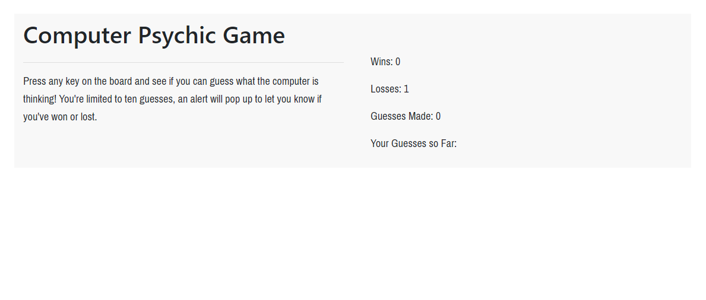

# Psyc-Game

Overview: 

The Psychic Game allows the user to select any letter on the keyboard and the app will show whether or not the computer chose the same.

On the screen there is a tracker that shows the wins, losses, the past guesses and how many guesses are left.

As the player chooses letters their options are displayed in the "Your guesses so far" section as well as the number of how many guesses they've made

Once the user has tried ten times and still hasn't matched the computers choice then they're alerted that they've lost

and then restart them with a new game with their losses numbered 

Once you've guessed the same letter as the computer the user will be alerted and their win will be added to the "wins" tab and the game is restarted.

